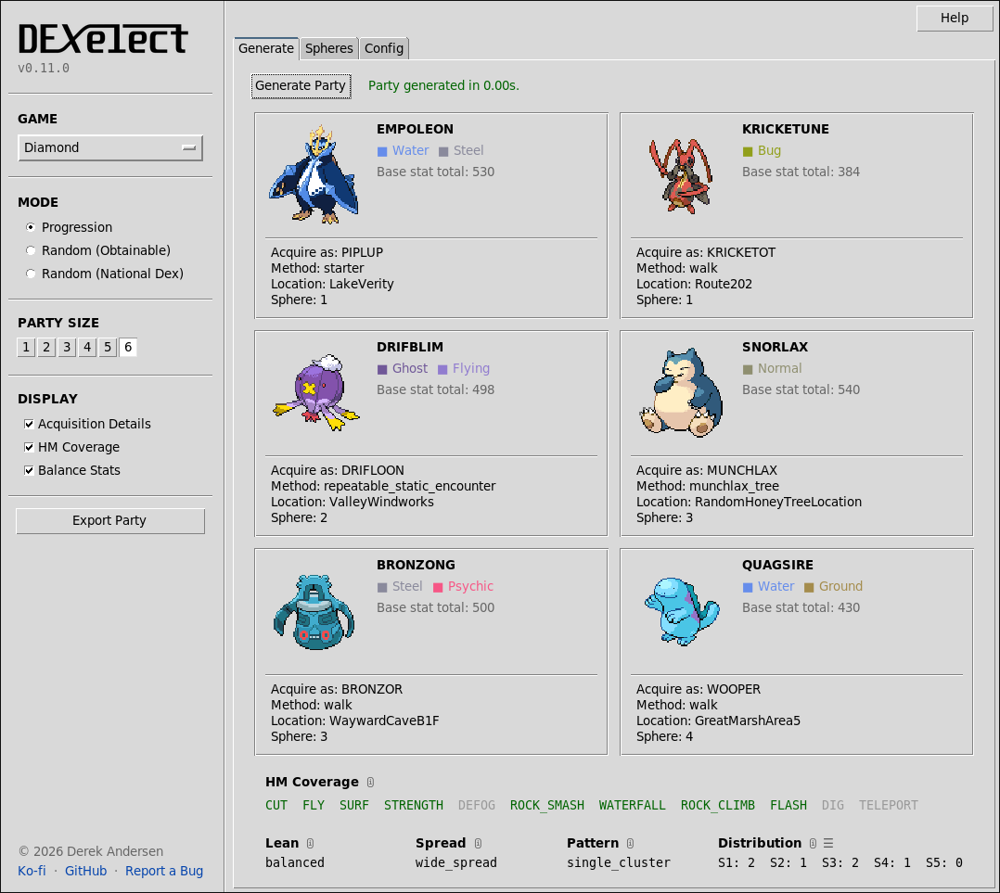

  <picture>
    <source media="(prefers-color-scheme: dark)" srcset="assets/logo/dexelect-logo-white.png">
    <source media="(prefers-color-scheme: light)" srcset="assets/logo/dexelect-logo-black.png">
    
  </picture>

<i>Dex (as in Pokédex) + elect / select = Dexelect</i>

  
   
  
   

# Dexelect – Progression-aware Party Generator

Dexelect is a tool for generating (prescribing) a random, progression-faithful party of Pokémon for use in a challenge playthrough. Customization options are available to curate the output party further.

  

## Table of Contents
1. [Introduction](#introduction)
2. [Currently supported games](#currently-supported-games)
3. [Installation](#installation)
4. [Usage](#usage)
5. [Credits](#credits)
6. [Support the app](#support-dexelect)

## Introduction
Dexelect generates (prescribes) a **progression-faithful** party for use in a playthrough — either to introduce an element of 
challenge or simply for team inspiration. See the [suggested rulesets](/docs/RULESETS.md) for some ideas about how to use Dexelect.

The app is **universal** in that it maintains compatibility with most generations of Pokémon games, 
_and_ with romhacks that contain changes to game data, such as:

- Pokémon
- Evolution methods
- Locations

See [`CONTRIBUTING.md`](/CONTRIBUTING.md) if you'd like to add support for a romhack.

## Currently supported games

### Vanilla

| Gen | Game       | Supported |
|-----|------------|-----------|
| 1   | Red        | ✔         |
| 1   | Blue       | ✔         |
| 1   | Yellow     | Planned   |
| 2   | Gold       | ✔         |
| 2   | Silver     | ✔         |
| 2   | Crystal    | Planned   |
| 3   | Ruby       | ✔         |
| 3   | Sapphire   | ✔         |
| 3   | Emerald    | Planned   |
| 4   | Diamond    | ✔         |
| 4   | Pearl      | ✔         |
| 4   | Platinum   | Planned   |

### Romhacks

| Gen | Game | Supported |
|-----|-----------------------------------------------------------|----|
| 1   | [Solus RGB](https://github.com/Dechrissen/poke-solus-rgb) | ✔  |

### Implementation quirks
- **Munchlax trees** – In Diamond/Pearl/Platinum, [Munchlax trees](https://bulbapedia.bulbagarden.net/wiki/Honey_Tree#Munchlax_trees) are a special case to handle. A random 4/21 total Honey Trees in the game are upgraded to special Munchlax trees in which Munchlax can be encountered 1% of the time. The locations are dependent on Trainer ID and secret ID, so there's no way to know where they are until finding them in a new file. This means there is no reliable point in the game to use as the acquisition point for Munchlax, and the party balance stats will not be 100% accurate. The solution I settled on for Dexelect (since it uses a sphere progression system) was to _assume that Munchlax trees are accessible in Sphere 3_, since by that point in the game, the probability of having access to at least one of the 4 Munchlax trees is 91% (up from 77% in Sphere 2 and 0% in Sphere 1) which seemed like a high enough probability to rely on for calculating party balance stats.

## Installation

### Option 1: Download (Windows/Linux)

1. Download and extract `dexelect-<version>-<platform>.zip` from the [latest release](https://github.com/Dechrissen/dexelect/releases/latest)
2. Run `dexelect.exe` on Windows, or `./dexelect` on Linux
3. **Linux only** (optional): After extracting, run `./install.sh` to register Dexelect with your app launcher — you can then delete the downloaded folder. To update, repeat these steps with the new version (the old one will be overwritten).

### Option 2: Build the binary (Windows/Linux)

Follow the [build instructions](/docs/BUILD.md).

### Option 3: Run from source (terminal)

Requires Python 3.10+.

1. `git clone https://github.com/Dechrissen/dexelect.git`
2. `cd dexelect`
3. `pip install -r requirements.txt` (virtual environment recommended)
4. (Optional) `python main.py --fetch-sprites` to enable sprite display in the GUI
5. `python main.py`

## Usage

### Using the GUI
- The app is split into sidebar (left) and main window (right). Help option is at the top right.
- Left sidebar:
  - The mode can be switched between 'Progression', 'Random (Obtainable)', and 'Random (National Dex)'
  - Party size can be adjusted (1–6)
  - 'Acquisition Details', 'HM Coverage', and 'Balance Stats' display can each be toggled on or off
  - 'Export Party' button exports party to `.txt` file
- Main window:
  - 'Generate', 'Spheres', and 'Config' tabs at the top can be switched between
  - Click 'Generate Party' (or press Enter) to generate a party
  - Change sphere generation mode and view per-sphere location lists in the 'Spheres' tab
  - Modify settings in the 'Config' tab to fine-tune output
  
> [!NOTE]
> If you are running the standalone binary, the config files are in `/_internal/config`. They can be modified in a text editor, but the 'Config' tab in the GUI is preferred.

### Using the CLI app (`python main.py --ui=cli`)
- `ENTER` – Generate a party with the current settings
- `G` – Open the 'Supported Games' menu to switch current game
- `M` – Open the 'Generation Mode' menu to change the party generation mode
- `P` – Open the 'Set Party Size' menu to set party size (1–6)
- `R` – Reload the config file from disk (after making any config changes while the app is running)
- `H` – Display help menu
- `Q` – Quit the app

#### Modifying config settings for the CLI app
Open `/config/config_gen1.yaml` (for Gen 1 games for instance). Modify values according to your preferences. 
Save the file and then, if the app was running, use the `R` option in the app to reload.

## Credits
- [Quadrixis](https://github.com/Quadrixis) – assistance with progression data planning and app testing

## Support Dexelect

Please support Dexelect development! The app is free and open-source, but you can support it in these ways:
- [Donate on Ko-fi](https://ko-fi.com/Q5Q311GBFF)
- Give this repository a Star :star:
- Join the [Discord](https://discord.gg/YTxu5uM7r6)
- Share the app with someone who might be interested

## Contributing

If you'd like to add support for a missing game or romhack, see [`CONTRIBUTING.md`](/CONTRIBUTING.md).

## License

Dexelect is licensed under the MIT License (see [`LICENSE`](/LICENSE)).

## Disclaimer on LLM usage

The core code in this project (i.e., `core.py` logic and functions, data file format, data structures, classes) was neither designed nor written by an LLM.

The GUI wrapper was created using LLMs; as such the one file that was exclusively authored by an LLM in this project is `/ui/gui/app.py`. Development work on this project is sometimes carried out utilizing LLMs for certain tedious tasks such as data file creation / formatting (the `.yaml` files in `/data`).
